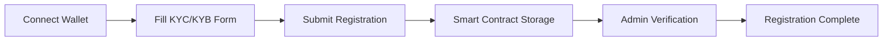
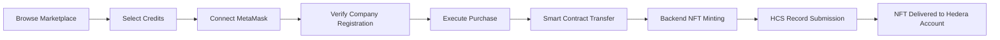
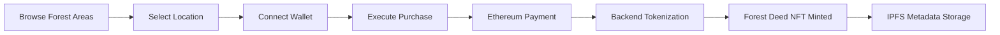
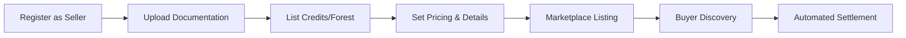

# 🌱 CarbonChain Marketplace

[](https://opensource.org/licenses/MIT)
[](https://reactjs.org/)
[](https://soliditylang.org/)
[](https://hedera.com/)
[](https://nodejs.org/)

> A decentralized carbon credits and forest area marketplace with automatic NFT certificate minting on Hedera Hashgraph network

## 🎯 Overview

CarbonChain Marketplace is a comprehensive web3 platform that enables companies to buy and sell verified carbon credits and forest areas while automatically generating NFT certificates of ownership. The platform combines Ethereum smart contracts for marketplace functionality with Hedera Hashgraph for NFT minting, consensus services, and decentralized storage.

### ✨ Key Features

- 🏢 **Company Registration & KYC/KYB** - Complete onboarding with emissions tracking and verification
- 💰 **Carbon Credits Trading** - Buy and sell verified carbon offset credits with full transparency
- 🌲 **Forest Area Marketplace** - Purchase and tokenize forest land ownership with deed storage
- 🎨 **Automatic NFT Minting** - Each purchase generates an ownership certificate NFT on Hedera
- 📊 **Real-time Analytics** - Market data, portfolio tracking, and environmental impact metrics
- 🌍 **IPFS Storage** - Decentralized metadata and document storage via Pinata
- 🔐 **Smart Contract Security** - Automated escrow, payment distribution, and access controls
- 📱 **Responsive UI** - Modern React interface with TailwindCSS and HashConnect wallet integration
- 🤝 **Hedera Consensus Service** - Immutable transaction records and audit trails

## 🏗 Architecture

```
┌─────────────────┐    ┌─────────────────┐    ┌─────────────────┐
│   Frontend      │    │   Backend       │    │   Blockchain    │
│   (React/Vite)  │◄──►│   (Node.js)     │◄──►│  (Ethereum +    │
│                 │    │                 │    │    Hedera)      │
│ • Marketplace   │    │ • API Server    │    │ • Smart         │
│ • Registration  │    │ • NFT Minting   │    │   Contracts     │
│ • Analytics     │    │ • Consensus     │    │ • NFT Storage   │
│ • Wallet (HC)   │    │ • IPFS Upload   │    │ • HCS Topics    │
└─────────────────┘    └─────────────────┘    └─────────────────┘
```


## 🚀 Quick Start

### Prerequisites

- **Node.js 18+** and npm
- **MetaMask** or **HashConnect** compatible Web3 wallet
- **Hedera Testnet account** (for NFT minting and consensus)
- **Pinata IPFS account** (for metadata storage)
- **Ethereum testnet** access (Sepolia recommended)

### Installation

```bash
# Clone the repository
git clone <your-repository-url>
cd test

# Install root dependencies
npm install

# Install backend dependencies
cd backend
npm install

# Install frontend dependencies
cd ../frontend
npm install

# Install smart contract dependencies
cd ../backend-web3
npm install
```

### Environment Setup

1. **Backend Configuration** (`.env` in `/backend`)
```env
# Hedera Configuration
OPERATOR_ID=0.0.YOUR_HEDERA_ACCOUNT
OPERATOR_KEY=YOUR_HEDERA_PRIVATE_KEY

# IPFS Configuration (Pinata)
PINATA_JWT=YOUR_PINATA_JWT_TOKEN
GATEWAY_URL=https://gateway.pinata.cloud

# Hedera Consensus Service
HCS_TOPIC_ID=0.0.YOUR_TOPIC_ID

# Server Configuration
PORT=5000
```

2. **Frontend Configuration** (`.env` in `/frontend`)
```env
# Smart Contract Addresses (update after deployment)
VITE_CONTRACT_ADDRESS=0xYOUR_MARKETPLACE_CONTRACT_ADDRESS
VITE_COMPANY_CONTRACT_ADDRESS=0xYOUR_COMPANY_CONTRACT_ADDRESS

# API Configuration
VITE_API_BASE_URL=http://localhost:5000

# Network Configuration
VITE_NETWORK_NAME=sepolia
VITE_NETWORK_ID=11155111
```

### Smart Contract Deployment

```bash
# Navigate to smart contracts directory
cd backend-web3

# Compile contracts
npx hardhat compile

# Deploy company registration contract
npx hardhat run deploy.js --network sepolia

# Update contract addresses in environment files
```

### Running the Application

```bash
# Terminal 1: Start backend server
cd backend
npm start

# Terminal 2: Start frontend development server
cd frontend
npm run dev
```

Visit `http://localhost:5173` to access the application.

## 📁 Project Structure

```
test/
├── 📁 frontend/                 # React frontend application (Vite)
│   ├── 📁 src/
│   │   ├── 📁 components/       # React components
│   │   │   ├── CompanyRegistration.jsx
│   │   │   ├── CarbonCreditSellerRegistration.jsx
│   │   │   ├── ForestSellerRegistration.jsx
│   │   │   ├── Marketplace.jsx
│   │   │   ├── Buy.jsx & BuyForest.jsx
│   │   │   ├── BuyCreditPopup.jsx
│   │   │   ├── Analytics.jsx
│   │   │   ├── Profile.jsx & SellerProfile.jsx
│   │   │   └── ...
│   │   ├── 📁 services/         # Web3 services
│   │   │   └── web3Service.js
│   │   ├── 📁 utils/           # Utility functions
│   │   │   └── validation.js
│   │   └── 📁 abi/             # Smart contract ABIs
│   │       ├── CarbonCreditMarketplace.json
│   │       ├── ForestTokenMarketplace.json
│   │       └── HandleCompany.json
│   ├── 📄 vite.config.ts       # Vite configuration
│   └── 📄 package.json
├── 📁 backend/                  # Node.js backend server
│   ├── 📄 server.js            # Express API server
│   ├── 📄 mint.js              # NFT minting service (Hedera)
│   ├── 📄 ipfs.js              # IPFS metadata handling (Pinata)
│   ├── 📄 consensus.js         # Hedera Consensus Service
│   ├── 📄 main.js              # Core business logic
│   └── 📄 package.json
├── 📁 backend-web3/            # Smart contracts (Hardhat)
│   ├── 📁 contracts/
│   │   ├── 📄 company.sol      # Company registration & KYC
│   │   ├── 📄 Selling.sol      # Carbon credits marketplace
│   │   └── 📄 BuyCredits.sol   # Enhanced buying with NFTs
│   ├── 📁 artifacts/           # Compiled contract artifacts
│   ├── 📄 hardhat.config.cjs   # Hardhat configuration
│   ├── 📄 deploy.js            # Deployment script
│   └── 📄 package.json
└── 📄 README.md
```


## 🔧 Core Components

### Smart Contracts

#### 1. Company Registration (`company.sol`)
- **HandleCompany** contract for KYC/KYB onboarding
- Hedera account ID mapping and verification
- Company profile management with emissions tracking
- Verification workflow and status management
- Integration with carbon credit purchasing system

#### 2. Carbon Credits Marketplace (`Selling.sol`)
- **CarbonCreditsMarketplace** contract for listing and trading
- Comprehensive project information storage
- Payment processing with automated distribution
- Registry compliance and verification tracking
- Support for multiple carbon credit standards

#### 3. Enhanced Buying System (`BuyCredits.sol`)
- **BuyCredits** contract integrating marketplace and company registration
- Automated NFT minting triggers on successful purchases
- Price validation and payment processing
- Credit allocation to company accounts
- Event emission for backend processing

### Backend Services

#### API Server (`server.js`)
- **RESTful API endpoints** for frontend integration
- NFT minting coordination with Hedera network
- Consensus service message submission
- CORS configuration and security middleware
- Error handling and response formatting

#### NFT Minting Service (`mint.js`)
- **Hedera NFT creation** for carbon credits and forest areas
- Dynamic metadata generation and IPFS upload
- Token transfer to buyer Hedera accounts
- Support for multiple NFT types (carbon-credit, forest)
- Integration with Pinata for metadata storage

#### IPFS Service (`ipfs.js`)
- **Metadata creation** for both carbon credits and forest deeds
- Pinata integration for decentralized storage
- Rich metadata structure with compliance information
- Image and document upload capabilities
- Gateway URL management for metadata access

#### Consensus Service (`consensus.js`)
- **Hedera Consensus Service (HCS)** integration
- Immutable transaction record keeping
- Topic-based message organization
- Query capabilities for audit trails
- Message submission with retry logic

### Frontend Application

#### Core Components
- **CompanyRegistration**: Complete KYC/KYB form with validation
- **CarbonCreditSellerRegistration**: Seller onboarding for carbon projects
- **ForestSellerRegistration**: Forest area seller registration
- **Marketplace**: Browse and filter carbon credits and forest areas
- **Buy/BuyForest**: Separate purchase flows for different asset types
- **BuyCreditPopup**: Modal for carbon credit purchases with MetaMask
- **Analytics**: Market data visualization and portfolio tracking
- **Profile Components**: User dashboard and seller profiles

#### Wallet Integration
- **HashConnect** for Hedera wallet connection
- **MetaMask** for Ethereum smart contract interactions
- Dynamic Hedera account ID fetching from company registration
- Transaction status monitoring and user feedback
- Multi-wallet support for cross-chain functionality

## 🔄 User Journey

### 1. Company Registration & KYC


### 2. Carbon Credit Trading Flow


### 3. Forest Area Purchase Flow


### 4. Seller Registration & Listing



## 🎨 NFT Certificates

The platform automatically generates NFT certificates for two types of purchases:

### Carbon Credit NFTs
Each carbon credit purchase creates a comprehensive NFT containing:
- **Project Information**: Name, type, location, country, registry details
- **Credit Specifications**: Amount purchased, vintage year, serial numbers
- **Purchase Data**: Transaction hash, buyer details, purchase date and price in HBAR
- **Verification**: Accredited registry compliance and documentation links
- **Environmental Impact**: CO2 reduction amount and calculation methodology

### Forest Area NFTs
Forest area purchases generate deed NFTs with:
- **Location Details**: GPS coordinates, area size, legal description
- **Ownership Information**: Buyer details, purchase price, transaction reference
- **Documentation**: IPFS-stored deed images and legal documents
- **Environmental Data**: Biodiversity information, conservation status
- **Legal Compliance**: Local regulations and authorization documentation

### NFT Metadata Structure

**Carbon Credit NFT:**
```json
{
  "name": "Carbon Credit Certificate #123",
  "description": "Certificate for 5 tons CO2 offset from verified forest conservation project",
  "image": "ipfs://QmHash.../certificate.png",
  "attributes": [
    {"trait_type": "CO2 Offset Amount", "value": "5 tons"},
    {"trait_type": "Project Name", "value": "Amazon Rainforest Conservation"},
    {"trait_type": "Vintage Year", "value": "2024"},
    {"trait_type": "Registry", "value": "Verified Carbon Standard (VCS)"},
    {"trait_type": "Project Country", "value": "Brazil"},
    {"trait_type": "Purchase Date", "value": "2024-10-04"}
  ],
  "properties": {
    "ethereum_tx_hash": "0x...",
    "buyer_hedera_id": "0.0.123456",
    "amount": 5,
    "total_price": "0.075 HBAR"
  }
}
```

**Forest Area NFT:**
```json
{
  "name": "Forest Area Deed #456",
  "description": "Digital deed for 2.5 hectares of protected forest land",
  "image": "ipfs://QmHash.../forest_deed.jpg",
  "attributes": [
    {"trait_type": "Area Size", "value": "2.5 hectares"},
    {"trait_type": "Location", "value": "Costa Rica, Guanacaste Province"},
    {"trait_type": "Conservation Status", "value": "Protected"},
    {"trait_type": "Biodiversity Score", "value": "High"},
    {"trait_type": "Purchase Date", "value": "2024-10-04"}
  ],
  "properties": {
    "ethereum_tx_hash": "0x...",
    "buyer_hedera_id": "0.0.789012",
    "area_hectares": 2.5,
    "deed_ipfs_hash": "QmDeedHash..."
  }
}
```


## 📊 Analytics & Reporting

### Market Analytics Dashboard
- **Total Carbon Credits Traded** - Volume and value metrics
- **Forest Area Transactions** - Hectares sold and conservation impact
- **Price Trends** - Historical pricing data and market analysis
- **Active Participants** - Registered companies, buyers, and sellers
- **Environmental Impact** - Total CO2 offset and forest area protected
- **Geographic Distribution** - Project locations and regional activity

### Company Portfolio Dashboard
- **Purchase History** - Complete transaction records with NFT certificates
- **Carbon Credit Holdings** - Current portfolio with expiration tracking
- **Forest Ownership** - Deed management and area visualization
- **Emissions Tracking** - Scope 1, 2, 3 emissions with offset calculations
- **Compliance Reporting** - Regulatory compliance and audit trail access
- **Portfolio Valuation** - Real-time market value of holdings

### Seller Analytics
- **Listing Performance** - Sales velocity and pricing optimization
- **Buyer Demographics** - Customer analysis and market insights
- **Revenue Tracking** - Payment history and financial reporting
- **Project Verification Status** - Documentation and compliance tracking

## 🔐 Security Features

### Smart Contract Security
- Reentrancy protection
- Access control modifiers
- Input validation and sanitization
- Emergency pause functionality

### Backend Security
- Private key management
- Rate limiting and DDoS protection
- Input validation and sanitization
- Secure IPFS metadata handling

### Frontend Security
- XSS protection
- Secure wallet connections
- Input validation
- Error boundary handling

## 🌐 API Documentation

### NFT Minting API

**Mint Carbon Credit NFT:**
```http
POST /api/mint
Content-Type: application/json

{
  "type": "carbon-credit",
  "data": {
    "buyer": "0.0.123456",
    "amount": 5,
    "projectName": "Amazon Forest Conservation",
    "totalPrice": "0.075 HBAR",
    "id": "ethereum_tx_hash"
  }
}
```

**Mint Forest Area NFT:**
```http
POST /api/mint
Content-Type: application/json

{
  "type": "forest",
  "data": {
    "buyer": "0.0.123456",
    "location": "Costa Rica, Guanacaste",
    "area": 2.5,
    "totalPrice": "1.5 HBAR",
    "areaId": "ethereum_tx_hash",
    "ipfsDeedHash": "QmDeedHash..."
  }
}
```

### Tokenization APIs

**Tokenize Carbon Credit Purchase:**
```http
POST /api/tokenize-purchase
Content-Type: application/json

{
  "buyerHederaId": "0.0.123456",
  "amount": 5,
  "ethereumTxHash": "0x...",
  "buyerEthAddress": "0x...",
  "projectName": "Forest Conservation Project"
}
```

**Tokenize Forest Area Purchase:**
```http
POST /api/tokenize-forest-purchase
Content-Type: application/json

{
  "buyerHederaId": "0.0.123456",
  "ethereumTxHash": "0x...",
  "buyerEthAddress": "0x...",
  "location": "Costa Rica",
  "areaSize": 2.5,
  "price": "1.5 HBAR",
  "ipfsDeedHash": "QmDeedHash..."
}
```

### Hedera Consensus Service APIs

**Submit Message to HCS:**
```http
POST /api/consensus/submitMessage
Content-Type: application/json

{
  "topicId": "0.0.123456",
  "message": "Transaction record or audit data"
}
```

**Query Topic Messages:**
```http
GET /api/consensus/queryTopic/{topicId}
```

**Query Specific Message:**
```http
GET /api/consensus/queryTopic/{topicId}/{sequenceNumber}
```


## 🚀 Deployment

### Development Environment

**Prerequisites:**
- Node.js 18+ with npm
- Hardhat for smart contract development
- Hedera testnet account with sufficient HBAR
- Pinata account for IPFS storage
- Ethereum testnet access (Sepolia recommended)

### Smart Contract Deployment

```bash
# Navigate to contracts directory
cd backend-web3

# Compile contracts
npx hardhat compile

# Deploy company registration contract
npx hardhat run deploy.js --network sepolia

# Note: Update frontend .env with deployed contract addresses
```

### Backend Deployment

```bash
# Install production dependencies
cd backend
npm install --production

# Set production environment variables
# Copy .env.example to .env and configure:
# - OPERATOR_ID and OPERATOR_KEY for Hedera
# - PINATA_JWT for IPFS storage
# - HCS_TOPIC_ID for consensus service

# Start server
npm start
# or use PM2 for production
pm2 start server.js --name carbonchain-backend
```

### Frontend Deployment

```bash
# Build for production
cd frontend
npm run build

# Deploy to static hosting (Vercel, Netlify, etc.)
# Make sure to set environment variables:
# - VITE_CONTRACT_ADDRESS
# - VITE_COMPANY_CONTRACT_ADDRESS
# - VITE_API_BASE_URL

# Example with Vercel
npx vercel --prod
```

### Production Configuration

**Environment Variables for Production:**
- Update all contract addresses to mainnet deployments
- Use production Hedera mainnet accounts and topics
- Configure production IPFS gateways and Pinata settings
- Set up proper monitoring, logging, and alerting
- Enable SSL/TLS for all API endpoints
- Configure proper CORS policies for production domains

## 🧪 Testing

### Smart Contract Testing
```bash
cd backend-web3

# Run contract tests (if test files exist)
npx hardhat test

# Test contract compilation
npx hardhat compile

# Verify deployment on testnet
npx hardhat verify --network sepolia <deployed-contract-address>
```

### Backend API Testing
```bash
cd backend

# Install test dependencies
npm install --dev

# Run API tests (when implemented)
npm test

# Manual API testing with curl or Postman
curl -X POST http://localhost:5000/api/mint \
  -H "Content-Type: application/json" \
  -d '{"type":"carbon-credit","data":{"buyer":"0.0.123456","amount":5}}'
```

### Frontend Testing
```bash
cd frontend

# Run component tests
npm run test

# Build test to verify production build
npm run build

# Lint code for quality assurance
npm run lint
```

### Integration Testing
- Test complete purchase flow from frontend to NFT minting
- Verify Hedera consensus service message submission
- Test wallet integration (MetaMask + HashConnect)
- Validate IPFS metadata upload and retrieval


## 🛣 Roadmap

### Phase 1: Core Platform ✅
- [x] Company registration and KYC/KYB system
- [x] Carbon credits marketplace with smart contracts
- [x] Forest area marketplace and tokenization
- [x] NFT certificate minting on Hedera
- [x] MetaMask and HashConnect wallet integration
- [x] IPFS metadata storage via Pinata
- [x] Hedera Consensus Service integration

### Phase 2: Enhanced Features 🚧
- [ ] Advanced analytics dashboard with environmental impact metrics
- [ ] Mobile-responsive design improvements
- [ ] Multi-language support (Spanish, Portuguese, French)
- [ ] Batch purchasing capabilities with volume discounts
- [ ] Real-time price feeds and market data integration
- [ ] Enhanced search and filtering for marketplace
- [ ] Push notifications for important events

### Phase 3: Ecosystem Expansion 📋
- [ ] Carbon credit fractionalization for smaller buyers
- [ ] Secondary market trading between registered companies
- [ ] Cross-chain integration (Polygon, Arbitrum)
- [ ] API for third-party platform integration
- [ ] Carbon footprint calculator and tracking tools
- [ ] Integration with major carbon registries (VCS, Gold Standard, CDM)
- [ ] Automated compliance reporting features

### Phase 4: Enterprise & Scaling 📋
- [ ] White-label solutions for other marketplaces
- [ ] Enterprise API with rate limiting and authentication
- [ ] Advanced reporting and audit trail features
- [ ] Carbon accounting automation and ERP integration
- [ ] Machine learning for price prediction and market analysis
- [ ] Institutional trading features and OTC markets
- [ ] Regulatory compliance modules for different jurisdictions

### Phase 5: Innovation & Sustainability 🔮
- [ ] AI-powered project verification and risk assessment
- [ ] Satellite monitoring integration for forest areas
- [ ] Blockchain-based supply chain tracking
- [ ] Decentralized governance (DAO) for platform decisions
- [ ] Staking mechanisms for platform token holders
- [ ] Integration with ESG reporting standards
- [ ] Virtual reality forest area visualization

## 🤝 Contributing

We welcome contributions from the community! Please follow these guidelines:

### Development Setup

1. **Fork the repository** and clone your fork
2. **Create a feature branch:** `git checkout -b feature/amazing-feature`
3. **Install dependencies** in all directories (frontend, backend, backend-web3)
4. **Set up environment variables** as described in the Quick Start section
5. **Make your changes** and test thoroughly
6. **Commit your changes:** `git commit -m 'Add amazing feature'`
7. **Push to your branch:** `git push origin feature/amazing-feature`
8. **Open a Pull Request** with a clear description

### Code Standards

- **JavaScript/React**: Follow ESLint rules configured in the project
- **Solidity**: Use established patterns and include comprehensive comments
- **Git**: Use conventional commit messages (feat:, fix:, docs:, etc.)
- **Testing**: Add tests for new features and bug fixes
- **Documentation**: Update README and inline documentation for any changes

### Areas for Contribution

- � **Bug Fixes**: Check GitHub issues for reported bugs
- ✨ **Features**: Implement items from the roadmap
- 📚 **Documentation**: Improve guides, tutorials, and API documentation
- 🧪 **Testing**: Add unit tests, integration tests, and test coverage
- 🎨 **UI/UX**: Enhance user interface and user experience
- 🔒 **Security**: Security audits and vulnerability assessments
- 🌍 **Localization**: Add support for additional languages

## � Acknowledgments

- 🔒 **Security**: Security audits and vulnerability assessments
- 🌍 **Localization**: Add support for additional languages

## 📄 License

This project is licensed under the **MIT License** - see the [LICENSE](LICENSE) file for details.

---

<div align="center">
  <strong>🌱 Building a sustainable future through blockchain innovation 🌱</strong>
  
  **Made with ❤️ for environmental sustainability and carbon transparency**
</div>

## � License

This project is licensed under the **MIT License** - see the [LICENSE](LICENSE) file for details.

## � Team

- **Project Lead & Full-Stack Developer** - [@mananjain86](https://github.com/mananjain86)
- **Blockchain Development** - Smart contract architecture and Hedera integration
- **Frontend Development** - React application and user experience design
- **Backend Development** - API services and blockchain integration

## 📞 Support & Community

For support, questions, and community discussions:

- � **Email**: [manan.jain86@gmail.com](mailto:manan.jain86@gmail.com)
- � **Issues**: [GitHub Issues](https://github.com/mananjain86/test/issues)
- 📖 **Documentation**: Check the Wiki for detailed guides
- � **Discussions**: Use GitHub Discussions for feature requests and general questions

## 🔗 Resources

- **[Hedera Documentation](https://docs.hedera.com)** - Learn about Hedera Hashgraph
- **[Ethereum Developer Portal](https://ethereum.org/developers)** - Ethereum development resources
- **[React Documentation](https://react.dev)** - React framework documentation
- **[Hardhat Documentation](https://hardhat.org/docs)** - Smart contract development
- **[IPFS Documentation](https://docs.ipfs.tech)** - Decentralized storage concepts

---

<div align="center">
  <strong>🌱 Building a sustainable future through blockchain innovation 🌱</strong>
  
  **Made with ❤️ for environmental sustainability and carbon transparency**
</div>
